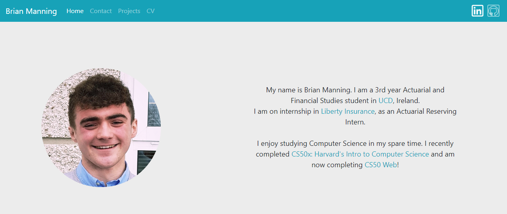

# Project 0 - My Personal Website

## Description

For Project 0, I created a personal website. This website displays some information about me, including my interests, work experience and projects. It was made using HTML, SCSS and Javascript.

### Pages:
1. Index: This is the home page, it displays an image of me and a brief about me.
2. Contact: This page contains links to my social media and my email address.
3. Projects: This page shows projects which I have completed.
4. CV: This page shows my past work experience and education.

#### Technologies

- HTML, SCSS, Javascript

---
